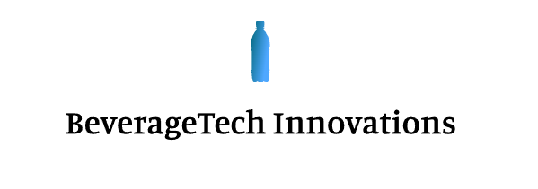

# Project Overview

The Beverage Inventory Optimization System (BIOS) is an experimental project designed to evaluate different technologies for optimizing inventory management in the beverage industry.

This repository for project management and documentation of the Beverage Inventory Optimization System project and technical documentation

# Project Goals
The goal of this project is to evaluate different technologies for optimizing inventory management in the beverage industry with [Project charter](./pm/project-charter.md).
The project will focus on evaluating the following technologies [Technical Projects](./pm/projects.md)
